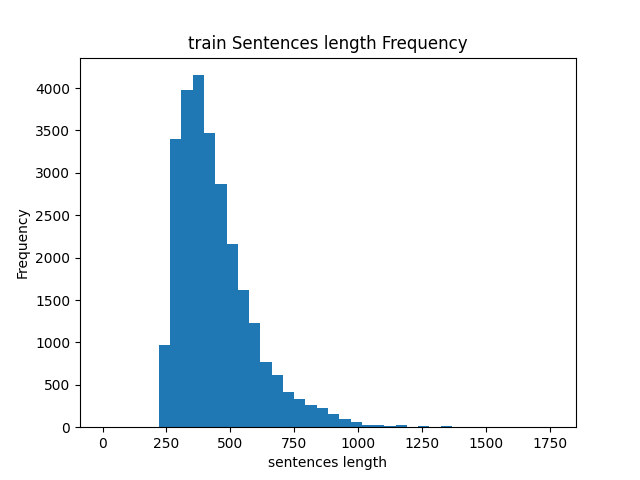

# Chinese Question Generation Based on Seq2Seq Model and Attention Mechanism

## Introduction 
In this task, we use Encoder-Decoder Model to finish chinese question generation tasks, which is 
given a pair of sentence and answer and using this model to gain question about the input sentences

## 1. About Datasets
In this project use two chinese datasets:
- [DRCD:a chinese machine reading comprehension datasets](https://github.com/DRCKnowledgeTeam/DRCD) 
- [ODSQA: Open-Domain Spoken Question Answering Datasets](https://github.com/chiahsuan156/ODSQA) 

Since they are all  traditional chinese character , we simplify this characters use this tools:
- [OpenCC](https://github.com/BYVoid/OpenCC) 
> Install Open CC
```bash
pip install opencc
```

### 1. Dataset Distribute 


段落的长度在[200, 1000]的范围内，中值是500 

## 2. preprocessing datasets
- the tokenizer is pre-trained model: `chinese-bert-base`


## 3. 训练集的格式
1. 当前训练集的格式为(src), 但是真正的训练集的格式为(src, answers, questions),验证集的格式为(src, answer)
2. 模型的输入可以采用[Seq, Seq, Seq [BOA]ans, ans [EOA], seq, seq, seq]


---
## 当前文本预处理出现的问题
1. 答案所在的句子，如果单一抽离出来，会损失上下文信息，对于模型理解句子来

## 目前存在的问题
1. 模型训练的结果出现很多0
2. 模型的loss不够好
3. 使用teach forcing 会导致Exposure Bias的问题

## 需要完成的任务：
1. 可视化训练集
2. 模型添加attention机制
3. 模型的评估指标加上ppl 
4. [FIXED] 修改模型的的Encoder和Decoder的max_len不相等
5. 添加模型的评测指标, 当前是crossEntropy
6. [FIXED]解码使用Beam Search
7. 处理 Height  Light Question的问题 

## 分析当前可能存在的问题
1. 因为模型的输入是单纯

--- 
## RL-Question-Generation 
- train_data[list: 88310]
  - train_data.src 的预处理没有切成统一的长度，用list装token后的结果，也就是数字
- trainData 通过Dataset去预处理训练集
- src_vocab_size
- opt.answer == 'enc'表示构建模型的时候带有答案编码器answer_encoder

---
## Acknowledgement 

我是NLP小白，刚接触这一块内容只有一个月，还有很多的东西是我不知道的，如果有同行的小伙伴发现代码实现有什么问题
欢迎参与讨论~